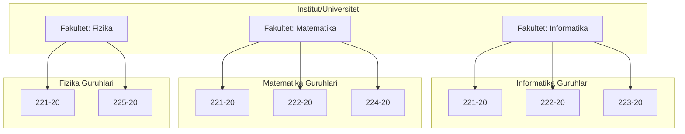
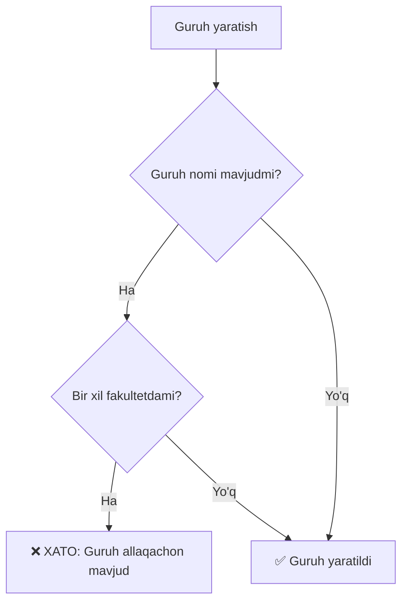
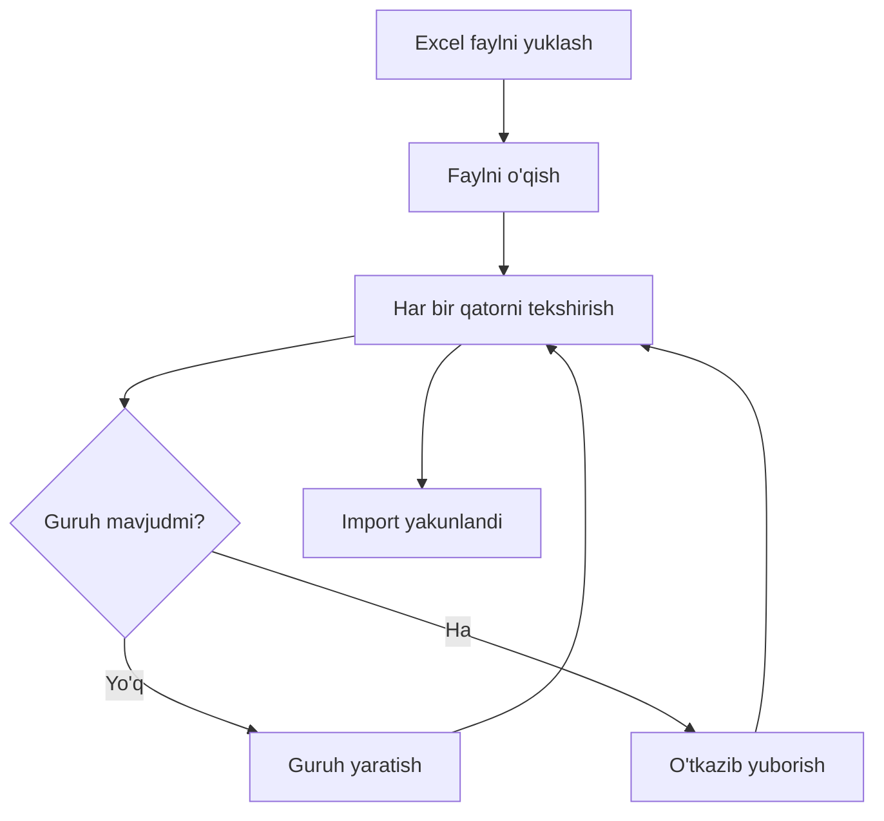

# Fakultet va Guruhlar Tuzilishi (Faculty-Group Structure)

## 🏛️ Sistem Arxitekturasi (System Architecture)



---

## 📊 Database Tuzilishi (Database Structure)


### Jadvallar (Tables):

#### `faculties` Table:
```
+----+--------------+------+------------------+-----------+
| id | name         | code | description      | is_active |
+----+--------------+------+------------------+-----------+
| 1  | Informatika  | INFO | IT va dasturlash | 1         |
| 2  | Matematika   | MATH | Amaliy matematik | 1         |
| 3  | Fizika       | PHYS | Fizika fanlari   | 1         |
+----+--------------+------+------------------+-----------+
```

#### `groups` Table (with composite unique):
```
+----+--------+--------------+---------------+-----------+
| id | name   | faculty      | student_count | is_active |
+----+--------+--------------+---------------+-----------+
| 1  | 221-20 | Informatika  | 25            | 1         |
| 2  | 222-20 | Informatika  | 30            | 1         |
| 3  | 221-20 | Matematika   | 28            | 1         |  ← Same name, different faculty ✅
| 4  | 222-20 | Matematika   | 22            | 1         |
| 5  | 221-20 | Fizika       | 20            | 1         |  ← Same name, different faculty ✅
+----+--------+--------------+---------------+-----------+

UNIQUE INDEX: (name, faculty) - Prevents duplicate group names within same faculty
```

---

## 🔐 Uniqueness Logic (Takrorlanmaslik Mantigi)



### Misol (Example):

```
Input: Guruh "221-20", Fakultet "Informatika"

Database Check:
SELECT COUNT(*) FROM groups 
WHERE name = '221-20' 
AND faculty = 'Informatika';

Result = 0  → ✅ Create group
Result > 0  → ❌ Show error: "Guruh '221-20' 'Informatika' fakultetida allaqachon mavjud"
```

---

## 🎓 Praktik Misol (Real-World Example)

### Toshkent Davlat Texnika Universiteti (TDTU)

```
TDTU
├── Informatika fakulteti
│   ├── 221-20 (Dasturiy injiniring)       [25 talaba]
│   ├── 222-20 (Axborot xavfsizligi)       [30 talaba]
│   └── 223-20 (Sun'iy intellekt)          [28 talaba]
│
├── Matematika fakulteti
│   ├── 221-20 (Amaliy matematika)         [20 talaba]  ✅ Same name as Informatika
│   ├── 222-20 (Statistika)                [22 talaba]  ✅ Same name as Informatika
│   └── 224-20 (Moliyaviy matematika)      [18 talaba]
│
└── Fizika fakulteti
    ├── 221-20 (Yadro fizikasi)            [15 talaba]  ✅ Same name as others
    ├── 225-20 (Astrofizika)               [17 talaba]
    └── 226-20 (Kvant mexanikasi)          [19 talaba]
```

### Nima uchun bu muhim? (Why is this important?)

1. **Har bir fakultet o'z guruh nomlarini boshqaradi**
   - Each faculty manages its own group naming

2. **Guruh nomlari odatda yil va tartib raqamni bildiradi**
   - Group names typically indicate year and sequence number
   - "221-20" = 2020-yilda kirgan, 2-fakultet, 1-guruh

3. **Har xil fakultetlar bir xil nomlardan foydalanishi mumkin**
   - Different faculties can use same naming conventions

---

## 💻 Kod Misollari (Code Examples)

### Creating Groups:

```php
// ✅ WORKS - Different faculties
Group::create(['name' => '221-20', 'faculty' => 'Informatika']);
Group::create(['name' => '221-20', 'faculty' => 'Matematika']);
Group::create(['name' => '221-20', 'faculty' => 'Fizika']);

// ❌ FAILS - Same faculty
Group::create(['name' => '221-20', 'faculty' => 'Informatika']);
Group::create(['name' => '221-20', 'faculty' => 'Informatika']); // Exception!
```

### Query Examples:

```php
// Get all groups from Informatika faculty
$groups = Group::where('faculty', 'Informatika')->get();

// Get specific group from specific faculty
$group = Group::where('name', '221-20')
             ->where('faculty', 'Informatika')
             ->first();

// Count groups per faculty
$stats = Group::select('faculty', DB::raw('count(*) as total'))
              ->groupBy('faculty')
              ->get();
```

---

## 🔄 Excel Import Jarayoni (Excel Import Process)



### Import Excel Format:

| A         | B           | Result                          |
|-----------|-------------|---------------------------------|
| 221-20    | Informatika | ✅ Created (first time)         |
| 222-20    | Informatika | ✅ Created                      |
| 221-20    | Matematika  | ✅ Created (different faculty)  |
| 221-20    | Informatika | ❌ Skipped (duplicate)          |

---

## 📈 Statistika (Statistics)

### Database Query for Stats:

```sql
-- Groups per faculty
SELECT 
    faculty,
    COUNT(*) as group_count,
    SUM(student_count) as total_students
FROM groups
GROUP BY faculty;

-- Duplicate group names across faculties (allowed)
SELECT 
    name,
    GROUP_CONCAT(faculty) as faculties,
    COUNT(*) as faculty_count
FROM groups
GROUP BY name
HAVING faculty_count > 1;
```

### Example Output:

```
Faculty Statistics:
+-------------+-------------+----------------+
| faculty     | group_count | total_students |
+-------------+-------------+----------------+
| Informatika | 3           | 83             |
| Matematika  | 3           | 60             |
| Fizika      | 3           | 51             |
+-------------+-------------+----------------+

Shared Group Names:
+--------+---------------------------+---------------+
| name   | faculties                 | faculty_count |
+--------+---------------------------+---------------+
| 221-20 | Informatika,Matematika... | 3             |
| 222-20 | Informatika,Matematika    | 2             |
+--------+---------------------------+---------------+
```

---

## 🎯 Xulosa (Conclusion)

✅ **Moslashuvchanlik (Flexibility):** Har bir fakultet o'z guruhlarini mustaqil boshqaradi

✅ **Ma'lumot yaxlitligi (Data Integrity):** Fakultet ichida takrorlanishni oldini oladi

✅ **Qulaylik (Usability):** Turli fakultetlar umumiy nomlardan foydalanishi mumkin

✅ **Masshtablanish (Scalability):** Universitet o'sishi bilan moslashadi

---

**📚 Dokumentatsiya yaratildi - 2025-10-28**
